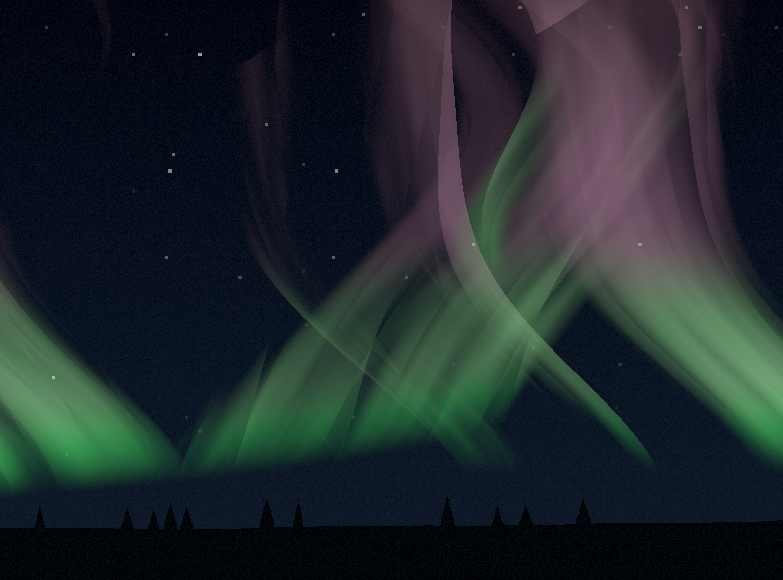

# northernlight

A small Rust + [wgpu](https://wgpu.rs/) demo that renders the northern lights
(aurora) as a fullscreen volumetric raymarch in WGSL.



## How it works

- `src/main.rs` — sets up the window ([winit](https://github.com/rust-windowing/winit)),
  GPU surface, render pipeline, and a per-frame uniform buffer (resolution +
  time). It draws a single fullscreen triangle each frame.
- `src/aurora.wgsl` — the vertex shader emits the fullscreen triangle; the
  fragment shader does all the work, raymarching the aurora and compositing the
  foreground.

## Build & run

```bash
cargo run --release
```

A window titled `northernlight` opens and animates immediately. Resize freely;
close the window to exit.

